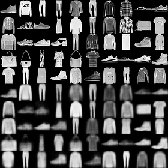

# CapsNet-Keras
[](https://github.com/XifengGuo/CapsNet-Keras/blob/master/LICENSE)

Switched the original project to Fashion MNIST dataset to see how capsule network handle this compared to digits.

**Reconstruction result**  

The result of CapsNet-v4 by launching   
```
python capsulenet.py --is_training 0 --weights result/trained_model.h5
```
Digits at top 5 rows are real images from MNIST and 
digits at bottom are corresponding reconstructed images.


